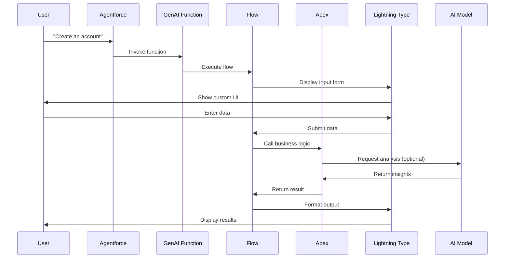

import { Card, Cards } from 'fumadocs-ui/components/card';
import { Step, Steps } from 'fumadocs-ui/components/steps';
import { Code, GitBranch, Bot, Layout, Puzzle, Layers, RotateCw, Wrench, FlaskConical, ArrowUpDown, ArrowRightLeft, Package } from 'lucide-react';

## Hybrid Architecture Design

This project implements a **hybrid approach** combining Apex classes, Flows, GenAI components, and Lightning Types to provide intelligent sales and service automation through Agentforce.

## Four-Layer Architecture

<Cards>
  <Card title="Business Logic Layer" icon={<Code />}>
    **Apex Classes**
    - Complex data processing
    - AI integration
    - SOQL queries
    - Reusable business logic
  </Card>
  
  <Card title="Orchestration Layer" icon={<GitBranch />}>
    **Flows**
    - Agentforce integration
    - Configuration management
    - Error handling
    - Non-developer friendly
  </Card>
  
  <Card title="Natural Language Layer" icon={<Bot />}>
    **GenAI Functions**
    - Conversational interfaces
    - Schema validation
    - Progress indicators
    - Seamless AI integration
  </Card>
  
  <Card title="Presentation Layer" icon={<Layout />}>
    **Lightning Types**
    - Custom UI components
    - Rich input forms
    - Beautiful output displays
    - Type safety
  </Card>
</Cards>

## Why This Architecture?

### Apex for Business Logic

**Complex Data Processing**

- Query and format data efficiently
- Build AI prompts with context
- Handle bulk operations
- Manage SOQL complexity

**Direct AI Integration**

- `aiplatform.ModelsAPI` integration
- Better error handling
- Custom prompt engineering
- Response parsing and formatting

**Reusability**

- Called from multiple flows
- Shared across contexts
- Single source of truth
- Easy to test and maintain

### Flows for Orchestration

**Agentforce Integration**

- GenAI Function invocation targets
- Parameter mapping
- Response handling
- Natural flow of conversation

**Configuration Without Code**

- Change parameters easily
- Update validation rules
- Modify error messages
- No code deployment required

**Built-in Error Handling**

- User-friendly error messages
- Graceful degradation
- Retry logic
- Status tracking

### GenAI Functions for Natural Language

**Conversational Interactions**

- Natural language commands
- Context-aware responses
- Multi-turn conversations
- Intent recognition

**Schema Validation**

- JSON schema for inputs/outputs
- Type checking
- Required field validation
- Error prevention

**Progress Tracking**

- Long-running operations
- Status updates
- User feedback
- Cancellation support

### Lightning Types for Custom UI

**Rich Input Forms**

- Structured data collection
- Dynamic picklists
- Field validation
- Help text and guidance

**Beautiful Output Displays**

- Card layouts with icons
- Formatted data
- Navigation links
- Professional appearance

**Type Safety**

- JSON schema validation
- Compile-time checking
- Runtime validation
- Error prevention

## Component Flow

## Data Flow Pattern

<Steps>
  <Step>
    **User Input**: User initiates conversation with Agentforce
  </Step>
  
  <Step>
    **GenAI Function**: Function validates input schema and invokes Flow
  </Step>
  
  <Step>
    **Lightning Type Editor**: Custom LWC displays input form with dynamic picklists
  </Step>
  
  <Step>
    **Flow Orchestration**: Flow receives data and calls Apex business logic
  </Step>
  
  <Step>
    **Apex Processing**: Apex performs SOQL queries, AI integration, and data processing
  </Step>
  
  <Step>
    **Lightning Type Renderer**: Custom LWC displays formatted results
  </Step>
  
  <Step>
    **User Response**: Agentforce presents final output to user
  </Step>
</Steps>

## Key Architectural Principles

<Cards>
  <Card title="Separation of Concerns" icon={<Layers />}>
    Each layer has a specific responsibility:
    - Business logic in Apex
    - Orchestration in Flows
    - UI in Lightning Types
    - Conversation in GenAI Functions
  </Card>
  
  <Card title="Reusability" icon={<RotateCw />}>
    Components are designed for reuse:
    - Apex classes shared across flows
    - Lightning Types reusable patterns
    - GenAI Functions composable
    - Flows configurable
  </Card>
  
  <Card title="Maintainability" icon={<Wrench />}>
    Easy to maintain and extend:
    - Non-developers can configure flows
    - Developers modify Apex logic
    - Designers update Lightning Types
    - AI prompts easily tuned
  </Card>
  
  <Card title="Testability" icon={<FlaskConical />}>
    Comprehensive testing strategy:
    - Unit tests for Apex classes
    - Flow tests for orchestration
    - Jest tests for LWCs
    - Integration tests for end-to-end
  </Card>
</Cards>

## Technology Stack

### Apex

- **Version**: Salesforce API v60.0
- **Key Features**:
  - `aiplatform.ModelsAPI` integration
  - `@InvocableMethod` for Flow integration
  - `@JsonAccess` for Lightning Types
  - Exception handling and logging

### Lightning Web Components

- **Framework**: LWC (Lightning Web Components)
- **Standards**: SLDS2 design system
- **Key Features**:
  - `@api` properties for Lightning Types
  - Event-driven architecture
  - Reactive patterns
  - Jest testing

### Flows

- **Type**: Auto-launched flows
- **Integration**: GenAI Function targets
- **Key Features**:
  - Input/output variables
  - Error handling
  - Apex action invocation
  - Status tracking

### AI Models

- **Platform**: Salesforce Einstein AI
- **Models**: OpenAI GPT-4o Mini
- **Key Features**:
  - Natural language processing
  - Semantic similarity analysis
  - Intelligent recommendations
  - Context-aware responses

## Next Steps

<Cards>
  <Card
    title="Lightning Types Deep Dive"
    icon={<Puzzle />}
    href="/docs/architecture/lightning-types"
  >
    Learn about custom Lightning Types
  </Card>
  
  <Card
    title="Apex Classes"
    icon={<Code />}
    href="/docs/architecture/apex-classes"
  >
    Explore the business logic layer
  </Card>
  
  <Card
    title="Flows & Orchestration"
    icon={<GitBranch />}
    href="/docs/architecture/flows"
  >
    Understand the orchestration layer
  </Card>
  
  <Card
    title="GenAI Functions"
    icon={<Bot />}
    href="/docs/architecture/genai-functions"
  >
    Dive into AI integration
  </Card>
</Cards>
