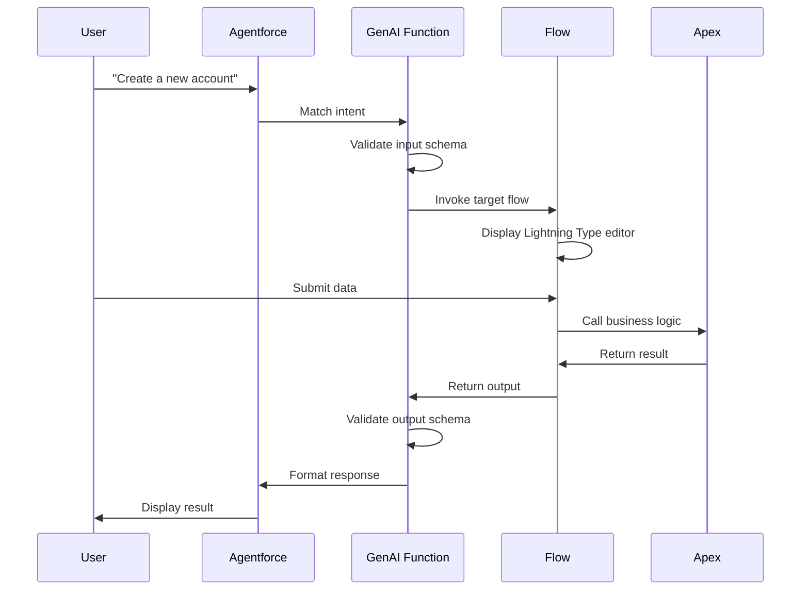

import { Card, Cards } from 'fumadocs-ui/components/card';
import { Callout } from 'fumadocs-ui/components/callout';

## GenAI Functions Layer

GenAI Functions provide the **natural language interface** between users and the system. They translate conversational requests into structured actions, validate inputs, and format outputs.

<Callout type="info">
GenAI Functions are the bridge that makes Agentforce understand and execute user intents through natural conversation.
</Callout>

## What are GenAI Functions?

GenAI Functions are metadata components that:

<Cards>
  <Card title="Natural Language Processing" icon="MessageSquare">
    Convert user intents to structured actions
  </Card>
  <Card title="Schema Validation" icon="ClipboardCheck">
    Validate inputs and outputs with JSON schemas
  </Card>
  <Card title="Flow Integration" icon="GitBranch">
    Invoke auto-launched flows as targets
  </Card>
  <Card title="Progress Tracking" icon="Loader">
    Monitor long-running operations
  </Card>
</Cards>

## Function Structure

### Metadata File

Each GenAI Function is defined in XML:

```xml
<?xml version="1.0" encoding="UTF-8"?>
<GenAiFunction xmlns="http://soap.sforce.com/2006/04/metadata">
    <apiName>Create_Account_with_Agent</apiName>
    <description>Creates a new account through conversational AI</description>
    <displayName>Create Account</displayName>
    <invocationTarget>flow:Create_Account_with_Agent</invocationTarget>
    <status>Active</status>
</GenAiFunction>
```

### Directory Structure

```
genAiFunctions/
└── Create_Account_with_Agent/
    ├── Create_Account_with_Agent.genAiFunction-meta.xml
    ├── input/
    │   └── schema.json
    └── output/
        └── schema.json
```

### Input Schema

Defines expected input structure:

```json
{
  "type": "object",
  "properties": {
    "accountInput": {
      "type": "lightning__accountInput",
      "description": "Account creation input data"
    }
  },
  "required": ["accountInput"]
}
```

### Output Schema

Defines expected output structure:

```json
{
  "type": "object",
  "properties": {
    "accountResult": {
      "type": "lightning__accountResult",
      "description": "Account creation result"
    }
  },
  "required": ["accountResult"]
}
```

## GenAI Function Categories

### Record Creation Functions

#### Create_Account_with_Agent

**building**

**Purpose**: Create accounts through conversation
    
    **Configuration**:
    - Display Name: "Create Account"
    - Invocation Target: `flow:Create_Account_with_Agent`
    - Input: `lightning__accountInput`
    - Output: `lightning__accountResult`
    
    **User Intents**:
    - "Create a new account"
    - "Add an account for Acme Corp"
    - "I need to create an account"

#### Create_Opportunity_with_Agent

**chart-line**

**Purpose**: Create opportunities with account lookup
    
    **Configuration**:
    - Display Name: "Create Opportunity"
    - Invocation Target: `flow:Create_Opportunity_with_Agent`
    - Input: `lightning__opportunityInput`
    - Output: `lightning__opportunityResult`
    
    **User Intents**:
    - "Create a new opportunity"
    - "Add an opportunity for Q4 renewal"
    - "I want to create an opp"

#### Create_Case_with_Agent

**ticket**

**Purpose**: Create cases with contact lookup
    
    **Configuration**:
    - Display Name: "Create Case"
    - Invocation Target: `flow:Create_Case_with_Agent`
    - Input: `lightning__caseInput`
    - Output: `lightning__caseResult`
    
    **User Intents**:
    - "Create a new case"
    - "Log a support case"
    - "Open a ticket"

#### Create_Contact_with_Agent

**user**

**Purpose**: Create contacts with account association
    
    **Configuration**:
    - Display Name: "Create Contact"
    - Invocation Target: `flow:Create_Contact_with_Agent`
    - Input: `lightning__contactInput`
    - Output: `lightning__contactResult`
    
    **User Intents**:
    - "Create a new contact"
    - "Add a contact"
    - "I need to add someone"

### Intelligence Functions

#### Analyze_Account

**brain**

**Purpose**: 6-dimension account health analysis
    
    **Configuration**:
    - Display Name: "Analyze Account Health"
    - Invocation Target: `flow:Analyze_Account_Flow`
    - Input: `accountId` (string)
    - Output: `accountHealthResult` (rich text)
    
    **User Intents**:
    - "Analyze this account's health"
    - "How healthy is this account?"
    - "What's the account score?"
    
    **Analysis Provided**:
    - Overall Health Score (0-100)
    - Renewal Risk Assessment
    - Expansion Opportunity Score
    - Sales Engagement Quality
    - Case Health
    - Revenue Intelligence

#### Analyze_Opportunity

**chart-line**

**Purpose**: Sales guidance with activity timeline
    
    **Configuration**:
    - Display Name: "Analyze Opportunity"
    - Invocation Target: `flow:Analyze_Opportunity_Flow`
    - Input: `opportunityId` (string)
    - Output: Analysis text (rich text)
    
    **User Intents**:
    - "Analyze this opportunity"
    - "What's the deal status?"
    - "Review this opp"
    
    **Analysis Provided**:
    - Activity timeline review
    - Deal momentum assessment
    - Risk identification
    - 3 actionable next steps

#### Find_Similar_Opportunities

**magnifying-glass**

**Purpose**: AI-powered similarity matching
    
    **Configuration**:
    - Display Name: "Find Similar Opportunities"
    - Invocation Target: `flow:Find_Similar_Opportunities_Flow`
    - Input: `opportunityId` (string)
    - Output: Similar opportunities (rich text)
    
    **User Intents**:
    - "Find similar opportunities"
    - "Show me related opps"
    - "What deals are like this one?"
    
    **Matching Criteria**:
    - Name similarity (25%)
    - Amount proximity (20%)
    - Stage matching (20%)
    - Account match (15%)

#### Analyze_Case_Priority

**ranking-star**

**Purpose**: AI-powered priority scoring
    
    **Configuration**:
    - Display Name: "Analyze Case Priority"
    - Invocation Target: `flow:Analyze_Case_Priority_Flow`
    - Input: `caseId` (string)
    - Output: Priority analysis (rich text)
    
    **User Intents**:
    - "Analyze case priority"
    - "What's the priority score?"
    - "Should this be escalated?"
    
    **Scoring Factors**:
    - Business impact (35%)
    - Customer tier (25%)
    - Severity (25%)
    - SLA risk (15%)

#### Find_Similar_Cases

**magnifying-glass**

**Purpose**: Semantic case matching
    
    **Configuration**:
    - Display Name: "Find Similar Cases"
    - Invocation Target: `flow:Find_Similar_Cases_Flow`
    - Input: `caseId` (string)
    - Output: Similar cases (rich text)
    
    **User Intents**:
    - "Find similar cases"
    - "Show me related tickets"
    - "What cases are like this?"
    
    **Matching Criteria**:
    - Case type (40%)
    - Subject similarity (30%)
    - Description similarity (30%)

### Management Functions

#### Update_Record_Field

**pen**

**Purpose**: Field updates with confirmation
    
    **Configuration**:
    - Display Name: "Update Field"
    - Invocation Target: `flow:Update_Record_Field_Flow`
    - Input: `recordId`, `fieldName`, `newValue`
    - Output: Success message
    
    **User Intents**:
    - "Update the priority to High"
    - "Change the status"
    - "Set the stage to Negotiation"

#### Undo_Field_Update

**rotate-left**

**Purpose**: Reverse field changes
    
    **Configuration**:
    - Display Name: "Undo Update"
    - Invocation Target: `flow:Undo_Field_Update_Flow`
    - Input: `recordId`, `fieldName`
    - Output: Restoration confirmation
    
    **User Intents**:
    - "Undo the last change"
    - "Revert the priority"
    - "Restore previous value"

#### Summarize_Record

**file-lines**

**Purpose**: AI-powered record summarization
    
    **Configuration**:
    - Display Name: "Summarize Record"
    - Invocation Target: `flow:Summarize_Record_Flow`
    - Input: `recordId`, `objectType`
    - Output: Summary text
    
    **User Intents**:
    - "Summarize this account"
    - "Give me a summary"
    - "What's the overview?"

## How GenAI Functions Work

### Execution Flow



### Intent Matching

Agentforce matches user intents to GenAI Functions through:

1. **Function Name**: "Create Account with Agent"
2. **Description**: "Creates a new account through conversational AI"
3. **Trained Patterns**: Learned from interactions
4. **Context**: Current record, conversation history

### Schema Validation

GenAI Functions validate data at two points:

<Steps>
  <Step>
    **Input Validation**: Before invoking the flow, validate that input matches schema
  </Step>
  
  <Step>
    **Output Validation**: After flow completes, validate that output matches schema
  </Step>
</Steps>

## Lightning Type Integration

GenAI Functions work seamlessly with Lightning Types:

### Input Lightning Types

```json
{
  "type": "object",
  "properties": {
    "accountInput": {
      "type": "lightning__accountInput"
    }
  }
}
```

This triggers the custom Lightning Type editor defined in:
- `lightningTypes/accountInput/lightningDesktopGenAi/editor.json`
- LWC: `accountInputEditor`

### Output Lightning Types

```json
{
  "type": "object",
  "properties": {
    "accountResult": {
      "type": "lightning__accountResult"
    }
  }
}
```

This triggers the custom Lightning Type renderer defined in:
- `lightningTypes/accountResult/lightningDesktopGenAi/renderer.json`
- LWC: `accountResultRenderer`

## Progress Tracking

For long-running operations, GenAI Functions support progress indicators:

```xml
<GenAiFunction>
    <progressIndicator>true</progressIndicator>
    <progressMessages>
        <message>Querying accounts...</message>
        <message>Analyzing data...</message>
        <message>Generating insights...</message>
        <message>Finalizing results...</message>
    </progressMessages>
</GenAiFunction>
```

## Error Handling

GenAI Functions handle errors gracefully:

```json
{
  "type": "object",
  "properties": {
    "success": {
      "type": "boolean"
    },
    "message": {
      "type": "string"
    },
    "errorDetails": {
      "type": "string"
    }
  }
}
```

**Error Response Flow**:
1. Flow encounters error
2. Flow returns error in standard format
3. GenAI Function validates error structure
4. Agentforce displays user-friendly message

## Testing GenAI Functions

### Test in Agentforce Chat

<Steps>
  <Step>
    **Configure Agent**: Add GenAI Plugin to your Agentforce agent
  </Step>
  
  <Step>
    **Start Conversation**: Use natural language to trigger function
  </Step>
  
  <Step>
    **Verify Input**: Check that Lightning Type editor displays correctly
  </Step>
  
  <Step>
    **Submit Data**: Fill in form and submit
  </Step>
  
  <Step>
    **Verify Output**: Check that results display correctly
  </Step>
</Steps>

### Debug Mode

Enable debug mode to see:
- Input schema validation
- Flow invocation details
- Output schema validation
- Error messages

## Best Practices

#### Clear Descriptions

**file-lines**

Write clear, actionable descriptions:
    - ✅ "Creates a new account through conversational AI"
    - ❌ "Account function"
    
    Agentforce uses descriptions for intent matching.

#### Strict Schemas

**clipboard-check**

Define strict input/output schemas:
    - Mark required fields
    - Provide descriptions
    - Use appropriate types
    - Validate data types

#### Single Responsibility

**bullseye**

Each function should do one thing well:
    - ✅ "Create Account"
    - ❌ "Create Account or Update Existing"
    
    Split complex operations into multiple functions.

#### User-Friendly Names

**user**

Use natural language names:
    - ✅ "Create Account with Agent"
    - ❌ "ACC_CREATE_FUNC_01"
    
    Names appear in agent configuration and logs.

## Troubleshooting

#### Function Not Found

**magnifying-glass**

**Problem**: Agentforce can't find the function
    
    **Solutions**:
    - Verify function status is "Active"
    - Check function is added to GenAI Plugin
    - Ensure plugin is added to agent
    - Redeploy if needed

#### Schema Validation Failed

**triangle-exclamation**

**Problem**: "Input/output schema validation failed"
    
    **Solutions**:
    - Verify Lightning Type exists
    - Check Apex class has @JsonAccess
    - Validate property names match
    - Test schema independently

#### Flow Not Invoked

**diagram-next**

**Problem**: Function doesn't trigger flow
    
    **Solutions**:
    - Check invocationTarget format: `flow:FlowApiName`
    - Ensure flow is activated
    - Verify flow type is Auto-Launched
    - Check flow has correct input variables

#### Output Not Displaying

**eye-slash**

**Problem**: Results don't show in chat
    
    **Solutions**:
    - Verify output schema matches flow output
    - Check Lightning Type renderer exists
    - Test renderer LWC independently
    - Review browser console for errors

## Next Steps

<CardGroup cols={2}>
  <Card
    title="Lightning Types"
    icon="puzzle-piece"
    href="/docs/architecture/lightning-types"
  >
    Understand custom UI components
  </Card>
  
  <Card
    title="Flows"
    icon="diagram-next"
    href="/docs/architecture/flows"
  >
    Learn about flow orchestration
  </Card>
  
  <Card
    title="Features"
    icon="wand-magic-sparkles"
    href="/docs/features/overview"
  >
    See GenAI Functions in action
  </Card>
  
  <Card
    title="API Reference"
    icon="book"
    href="/api-reference/apex-classes"
  >
    Complete API documentation
  </Card>
</CardGroup>

