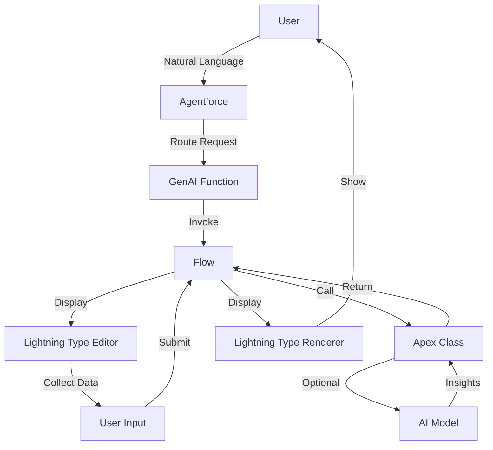

import { Card, Cards } from 'fumadocs-ui/components/card';
import { Step, Steps } from 'fumadocs-ui/components/steps';

## System Architecture

The Agentforce Sales & Service Agent follows a **four-layer hybrid architecture** that combines the best of declarative and programmatic approaches.

## Architecture Layers

### 1. Business Logic Layer (Apex)

The foundation of the system, handling all complex operations:

<Cards>
  <Card title="Account Management" icon="Building">
    - `AccountCreationAgent` - Record creation
    - `AccountIntelligence` - Health scoring
    - `AccountHelper` - Picklist utilities
    - `AccountRelationshipHealthController` - Dashboard data
  </Card>
  
  <Card title="Opportunity Management" icon="TrendingUp">
    - `OpportunityCreationAgent` - Record creation
    - `OpportunityIntelligence` - Sales guidance
    - `OpportunityHelper` - Stage picklists
    - `OpportunitySimilarityHelper` - AI matching
  </Card>
  
  <Card title="Case Management" icon="Ticket">
    - `CaseCreationAgent` - Record creation
    - `CasePriorityIntelligence` - Priority analysis
    - `CaseHelper` - Picklist utilities
    - `CaseSimilarityHelper` - Semantic matching
  </Card>
  
  <Card title="Contact Management" icon="User">
    - `ContactCreationAgent` - Record creation
    - Contact validation and formatting
    - Account association logic
  </Card>
</Cards>

### 2. Orchestration Layer (Flows)

Auto-launched flows that coordinate between components:

**Record Creation Flows**:
- `Create_Account_with_Agent`
- `Create_Opportunity_with_Agent`
- `Create_Case_with_Agent`
- `Create_Contact_with_Agent`

**Analysis Flows**:
- `Analyze_Account_Flow` - Health scoring
- `Analyze_Opportunity_Flow` - Sales guidance
- `Find_Similar_Opportunities_Flow` - Similarity matching
- `Find_Similar_Cases_Flow` - Case matching
- `Analyze_Case_Priority_Flow` - Priority analysis

**Management Flows**:
- `Update_Record_Field_Flow` - Field updates
- `Undo_Field_Update_Flow` - Undo operations
- `Summarize_Record_Flow` - Record summaries

### 3. Natural Language Layer (GenAI Functions)

Bridges natural language to structured actions:

```json
{
  "name": "Create_Account_with_Agent",
  "description": "Create a new account through conversational AI",
  "invocationTarget": "flow:Create_Account_with_Agent",
  "inputSchema": {
    "type": "object",
    "properties": {
      "accountInput": {
        "type": "lightning__accountInput"
      }
    }
  }
}
```

Each GenAI Function includes JSON schemas for input/output validation and progress tracking for long-running operations.

### 4. Presentation Layer (Lightning Types)

Custom UI components for rich interactions:

**Lightning Type Structure**:
```
lightningTypes/
├── accountInput/
│   ├── schema.json          # Data structure
│   └── lightningDesktopGenAi/
│       └── editor.json      # Editor LWC reference
├── accountResult/
│   ├── schema.json
│   └── lightningDesktopGenAi/
│       └── renderer.json    # Renderer LWC reference
```

## Component Interactions

<Steps>
  <Step>
    **User Interaction**: User starts conversation: "Create a new account"
  </Step>
  
  <Step>
    **GenAI Function Routing**: Agentforce routes to `Create_Account_with_Agent` function
  </Step>
  
  <Step>
    **Flow Invocation**: Function invokes `Create_Account_with_Agent` flow
  </Step>
  
  <Step>
    **Lightning Type Editor**: Flow displays `accountInput` Lightning Type editor
  </Step>
  
  <Step>
    **Data Collection**: User fills form with dynamic picklists and validation
  </Step>
  
  <Step>
    **Apex Processing**: Flow calls `AccountCreationAgent.createAccount()`
  </Step>
  
  <Step>
    **AI Enhancement (Optional)**: Apex may call `aiplatform.ModelsAPI` for intelligence
  </Step>
  
  <Step>
    **Lightning Type Renderer**: Flow displays `accountResult` Lightning Type renderer
  </Step>
  
  <Step>
    **User Response**: Formatted results shown to user with navigation link
  </Step>
</Steps>

## Data Flow Diagram



## Key Design Decisions

### Why Apex for Business Logic?

**Complex SOQL Queries**

Apex excels at:
- Dynamic query building
- Relationship queries (up to 5 levels)
- Aggregate functions
- Query optimization

**AI Integration**

Direct API access:
- `aiplatform.ModelsAPI` for Einstein
- Custom prompt engineering
- Response parsing
- Error handling

**Bulk Operations**

Efficient data processing:
- DML batching
- Governor limit management
- Transaction control
- Rollback handling

### Why Flows for Orchestration?

**Visual Configuration**

Non-developers can:
- Update parameters
- Change validation rules
- Modify error messages
- Add/remove steps

**GenAI Function Integration**

Native support for:
- Invocation targets
- Input/output mapping
- Progress tracking
- Error handling

**Built-in Features**

Out-of-the-box capabilities:
- Error handling
- Retry logic
- Logging
- Debugging

### Why Lightning Types?

**Custom UI Components**

Rich interactions:
- Complex input forms
- Dynamic picklists
- Field validation
- Professional output

**Type Safety**

Compile-time checking:
- JSON schema validation
- Apex class binding
- Runtime validation
- Error prevention

**Reusability**

Shared patterns:
- Editor templates
- Renderer templates
- Validation logic
- Styling consistency

## Performance Considerations

<Cards>
  <Card title="Query Optimization" icon="Gauge">
    - Limit to 200 records for similarity analysis
    - Use indexed fields in WHERE clauses
    - Selective queries with proper filters
    - Relationship query optimization
  </Card>
  
  <Card title="AI Token Management" icon="Coins">
    - Truncate descriptions to 500 characters
    - Batch similar requests
    - Cache frequent queries
    - Optimize prompt engineering
  </Card>
  
  <Card title="Bulk Operations" icon="Layers">
    - DML batching where possible
    - Efficient loop structures
    - Governor limit awareness
    - Transaction management
  </Card>
  
  <Card title="Caching Strategy" icon="Database">
    - Cache picklist values
    - Store AI responses (where appropriate)
    - Reduce redundant queries
    - Session state management
  </Card>
</Cards>

## Security Model

<Steps>
  <Step>
    **Object-Level Security**: Validate CRUD permissions before operations
  </Step>
  
  <Step>
    **Field-Level Security**: Check field access for all read/write operations
  </Step>
  
  <Step>
    **Sharing Rules**: Respect sharing model with `with sharing` keyword
  </Step>
  
  <Step>
    **Input Validation**: Sanitize all user inputs before processing
  </Step>
  
  <Step>
    **Error Handling**: Never expose sensitive data in error messages
  </Step>
</Steps>

## Scalability

The architecture scales through:

<Cards>
  <Card title="Horizontal Scaling" icon="ArrowRightLeft">
    Add more GenAI Functions and Flows without impacting existing ones
  </Card>
  
  <Card title="Vertical Scaling" icon="ArrowUpDown">
    Enhance individual components independently
  </Card>
  
  <Card title="Modular Design" icon="Package">
    Each component can be upgraded without system-wide changes
  </Card>
</Cards>

## Next Steps

<Cards>
  <Card
    title="Lightning Types Deep Dive"
    icon="Puzzle"
    href="/docs/architecture/lightning-types"
  >
    Understand custom UI components
  </Card>
  
  <Card
    title="Apex Classes Reference"
    icon="Code"
    href="/docs/architecture/apex-classes"
  >
    Explore business logic implementation
  </Card>
  
  <Card
    title="Flows & Orchestration"
    icon="GitBranch"
    href="/docs/architecture/flows"
  >
    Learn about flow patterns
  </Card>
  
  <Card
    title="GenAI Functions"
    icon="Bot"
    href="/docs/architecture/genai-functions"
  >
    Discover AI integration details
  </Card>
</Cards>
